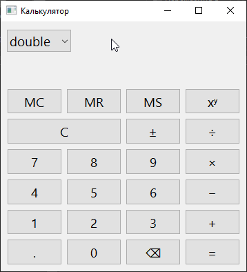

# Calculator

Кроссплатформенный калькулятор на Qt6 с поддержкой различных числовых типов.



## Возможности

* Базовые операции: +, −, ×, ÷, xʸ, ±, C, ⌫
* Память: MS, MR, MC
* Переключение между типами чисел: double, float, int, int64_t, size_t, uint8_t, Rational
* Отображение формулы и ошибок

## Технологии

- **Язык**: C++20
- **Фреймворк**: Qt6 (Widgets)
- **Стиль кода**: ООП, RAII
- **Архитектура**: MVC (Model-View-Controller)
- **Сборка**: CMake

## Требования

- Qt 6+
- Компилятор с поддержкой C++20
- CMake 3.16+

## Установка и запуск (Linux/Windows)

### Сборка с помощью CMake
```
mkdir build && cd build
cmake ..
cmake --build .
```
### Запуск
```
./calculator
```

### [Тестовая версия под Windows x64](calculator/bin)
